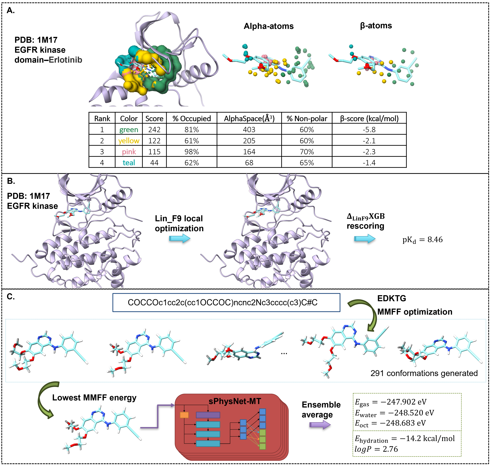

# Integrated Molecular Modeling and Machine Learning for Drug Design
In this tutorial, we will demonstrate how to use calculation and analysis tools mentioned in the perspective paper [Integrated Molecular Modeling and Machine Learning for Drug Design]().

## Clone this Repo
```
git clone --recurse-submodules -j8 https://github.com/SongXia-NYU/drug_discovery_perspective.git
```



## A. Protein Pocket Identification and Analysis with AlphaSpace

## B. Protein-ligand Binding Affinity Prediction with $\Delta_{LinF9}XGB$

## C. Small Molecule Properties Prediction with sPhysNet-MT-ens5
### Environment Setup
```bash
conda create -n sphysnet-mt python==3.8 -y
conda activate sphysnet-mt
bash sPhysNet-MT/bash_scripts/install_env_linux.bash
```


### Prediction with sPhysNet-MT-ens5
The SMILES of Erlotinib is `COCCOc1cc2c(cc1OCCOC)ncnc2Nc3cccc(c3)C#C`. To run prediction:

```bash
bash run_sphysnet_mt.sh "COCCOc1cc2c(cc1OCCOC)ncnc2Nc3cccc(c3)C#C"
```

You can run multiple compounds at once. For example: 
```bash
bash run_sphysnet_mt.sh "COCCOc1cc2c(cc1OCCOC)ncnc2Nc3cccc(c3)C#C C[C@H](c1c(ccc(c1Cl)F)Cl)Oc2cc(cnc2N)c3cnn(c3)C4CCNCC4 C[C@@H]1CCN(C[C@@H]1N(C)c2c3cc[nH]c3ncn2)C(=O)CC#N"
```
